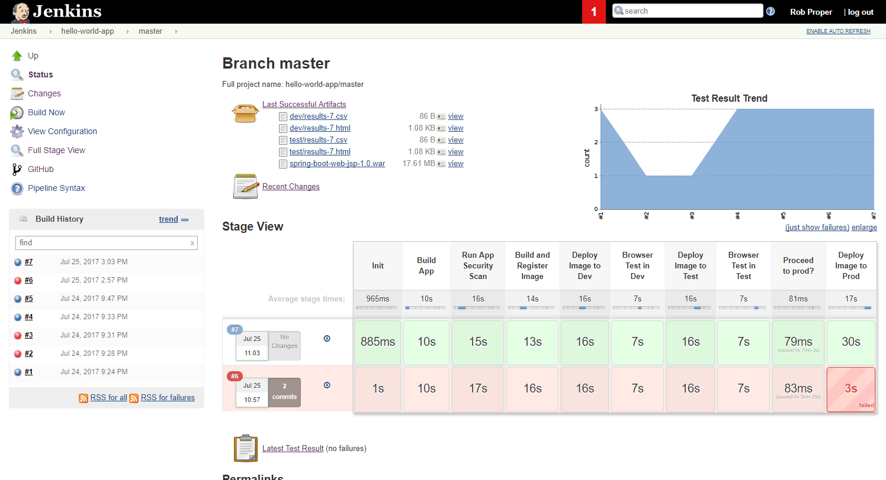

# DevSecOps Example CD/CD Pipeline

# Jenkins Multibranch Pipeline

## Steps

1. Build the (Java Springboot application using Maven.
   This includes runnuing unit tests.
2. Performa a security scan using SonarQube via Maven
3. Build and register a version Docker image
4. Deploy the image to the `dev` environment
5. Run automated browser tests against the application in the `dev` environment
6. Deploy the image to the `test` environment
7. Run automated browser tests against the application in the `test` environment
8. Pause for confirmation that the new image can be deployed to the `prod` environment.
   Allow for some manual tests to be executed before 
   This step times out after some (configurable amount of) time.

   [!Pause Pipeline](./doc/images/Jenkins-hello-world-master-pause.png)
   
9. Deploy the image to the `prod` environment

[Installation instructions](./doc/Install.md) can be found 
[here]((./doc/Install.md)).

# The Development Process

