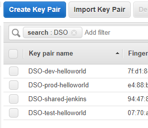

# Installation

This CI/CD pipeline example can be installed by running various cloud-formation scripts listed 
below.
Note that rather than using a single script this example uses multiple scripts toestablish a
separation of concerns (networking, security, application) to reflect a separation of these 
concerns that will be in effect in most organizations. 
Here the separation is used to demonstrate a scalable solution to this separation of concerns.
In a 'real world' secnario these cloud-formation scripts would be separated into separate
`git` repositories. However, here they are combined for convenience.

To provide scalability and consistency, all cloud-formation scripts have a set of common 
parameters, such as: `System` name, `Environment` name, `AWS Region`, 
and (optional) S3 `Provisioning Bucket`.
name. Furthermore that may have specific values, such as `CIDRBlock`, `Instance AMI` and 
`Instance Size`.
Those scripts that run additional EC2 initialization/provisioning use an S3 bucket to 
share information, e.g. files to be installed on an EC2 instance, 

The S3 bucket needs to follows the following structure, as it dictates access rights through
AWS IAM Policies that are generated by the [../cloud-formation/security] scripts:

```
      <bucket>/cloud-formation/<system>/<environment>/<stack>/<stack-resources>
```

One of the advantage of taking such a structured approach is that not only the application
pipeline can be fully automated), the infractructure could be fully automated using a
development pipeline as well.


## Prerequisites:

1. Create (or import) an [AWS EC2 keypair] with the name `<system>-shared-jenkins` and 
   save the private key.
   where Jenkins is the value of the parameter given to the cloud formation scripts.
2. Create (or import) an [AWS EC2 keypair] with the name `<system>-dev-helloworld` and 
   save the private key.
3. Create (or import) an [AWS EC2 keypair] with the name `<system>-test-helloworld` and 
   save the private key.
4. Create (or import) an [AWS EC2 keypair] with the name `<system>-prod-helloworld` and 
   save the private key.
5. Create an [AWS S3 bucket] for AWS resource provisioning 

Note that:
- The name is relevant, because the cloud-formation scripts, rather than having the named
  passed to it, internally builds the key pair name from the `System` and `Environment`
  parameters. The advantage is that this enforces a consistent naming sructure and 
  eliminates the need for passing the key pair names.
- The default values for <system> is `DSO` (default for cloud-formation parameters),
  so when you plan to use the default create a key pairs using DSO for <system>, 
  e.g. `DSO-shared-jenkins`.

  


## Install common AWS Resources:
To install the common AWS VPC and IAM resources run the following cloud-formation scripts:

1. Run the cloud-formation script in [network/shared](../cloud-formation/network/shared)
   Pass a `CIDRBlock` value for you VPC, e.g. `172.27.0.0/16`. The block needs to be large 
   enough to support 4 subnets.
2. Run the cloud-formation script in [security/shared](../cloud-formation/security/shared)
   (Optionally) pass a value to any of the `PrivilegedCIDRN` parameters to enable access 
   to resources on the private subnet.


## Install Jenkins on EC2 instance:
To install the the AWS resources for the Jenkins instance run the following cloud-formation
scripts and subsequently configure Jenkins:

1. Run the cloud-formation script in [network/jenkins](../cloud-formation/network/jenkins)
   Pass a value for parameter `JenkinsCIDRBlock`. This CIDR Block must fall within
   the VPC `CIDRBlock`, e.g. `172.27.1.0/24`
2. Run the cloud-formation script in [security/jenkins](../cloud-formation/security/jenkins)
   Pass a value for parameter `VPCCIDRBlock` that matches the earlier value 
   (see common AWS Resources).
   Pass a value to any of the `PrivilegedCIDRN` parameters to enable access 
   to resources on the private Jenkins subnet. At least one privileged address is needed
   to be able to obtain the initial Jenkins administrator password.
3. Run the cloud-formation script in [jenkins/app](../cloud-formation/jenkins/app)
   Jenkins is configured to 
   [run inside Docker](../cloud-formation/jenkins/app/etc-init.d-jenkins.sh).
   Furthermore, in this example setup the Jenkins instance also runs
   [SonarQube]() inside 
   [Docker](https://hub.docker.com/_/sonarqube/)
   Pass The name ofn AWS S3 Bucket you own in the account you are using to 
    value for `ProvisioningBucket` 
4. Configure Jenkins

   a. Get the initial administrator password:
      - Login to the Jenkins EC2 instance with the jenkins key 
        `ssh -i DSO-shared-jenkins <jenkins-public-ip>`
      - Get the key from `/var/jenkins_home/secrets/initialAdminPassword`

   b. Browse to Jenkins at `http://<jenkins-public-ip>` and use the initial password to login
   
   c. Choose to install the default plugins
   
   d. Next install the SSH and SSH Agent plugins under `Manage Jenkins > Manage Plugins`
   
   e. Create the following credentials under `Credentials > global`
      - A valid Git credential (ID: `*any*`)
      - An SSH Username with private key for the hello-world dev app instance 
        (ID: `DSO-dev-helloworld`, Username: `ec2-user`) using the private key from 
        the matching EC2 Keypair
      - An SSH Username with private key for the hello-world test app instance 
        (ID: `DSO-test-helloworld`, Username: `ec2-user`) using the private key from 
        the matching EC2 Keypair
      - An SSH Username with private key for the hello-world prod app instance 
        (ID: `DSO-prod-helloworld`, Username: `ec2-user`) using the private key from 
        the matching EC2 Keypair

    f. Add users as appropriate under `Manage Jenkins > Manage Users`


## Install the helloworld application on EC2 instances for a dev, test, and prod environment:

Repeat these steps passing `dev`, `test`, and `prod` as the parameter values for the 
`Environment` parameter in the various stacks:

1. Run the cloud-formation stack in [network/hello-world](../cloud-formation/network/helloworld)
   Pass a CIDRBlock 
2. Run the cloud-formation stack in [security/hello-world](../cloud-formation/security/helloworld/main.yml)
3. Run the cloud-formation stack in [helloworld/app](../cloud-formation/helloworld/app/main.yml)


[AWS EC2 key pair]: http://docs.aws.amazon.com/AWSEC2/latest/UserGuide/ec2-key-pairs.html
[AWS S3 bucket]: http://docs.aws.amazon.com/AmazonS3/latest/dev/UsingBucket.html
[SonarQube]: https://docs.sonarqube.org/display/SONAR/Documentation
[SonarQube Docker image]: https://hub.docker.com/_/sonarqube/