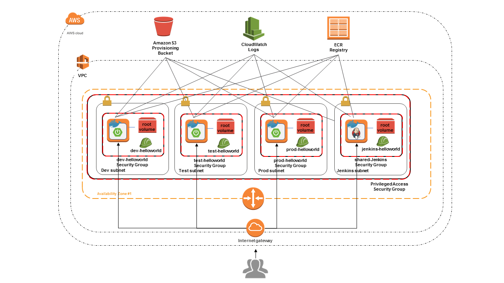

# Architecture

This DevSecOps example uses the following architecture:

- Provisioning S3 Bucket - Hold cloud formation template, stack policy and any files 
  needed to complete the provisioning using [cfn-init]

- VPC - Virtual networking resources consisting of
    * Individual subnets (environments, Jenkins)
    * Each individual subnet has its own NACL, so it could be modified later
    * Each individual subnet has its own SecurityGroup, so it could be modified later
      These groups must be assigned to the instances in the respective subnets
    * There is one overall Security Group that defines sources ([CIDR] blocks) of 
      priviledged access.
      These groups must be assigned to instances in the various subnets that need
      priviledged acess (specifically ssh)

- IAM - Policies defining access rules for the various resources (S3 bucket, ECR Registry,
  CloudWatch Logs). The main purpose is to defined priviledges for EC2 instances via 
  Roles/Instance Profiles. The policies are defined as limiting as possible, to allow 
  EC2 Instance to do
  [only what they need, but nothing more](https://en.wikipedia.org/wiki/Principle_of_least_privilege):
    * Provisioning Policy (S3 Access) - Access the S3 bucket for provisoining purposes
    * Logging Policy (CloudWatch Logs access) - Access to CloudWatch Logs to allow pushing of 
      log files
    * Image Push/Pull Policies (ECR Registry access) - Access to an ECR Registry to push or pull
      the hello world application docker image
    * Individual server type roles - Roles per type and environment to combine priviledges as
      appropriate.

- CloudWatch Logs - EC2 instances are stup with the [AWS Logs Agent]. This agent pushes 
  configured files to [AWS CloudWatch Logs] at a regular interval to reduce the need to access
  the server using SSH

- ECR Registry - IMplement a Docker Registry used to push and pull the Hello World app
  docker image to and from.

- EC2 Instances 
    * Every instance runs Docker; Applications run as a docker image
    * Jenkins runs [Jenkins docker image];
      Started from a service such that it is restarted as the EC2 instance is restarted
    * Jenkins runs [SonarQube docker image];
      Started from a service such that it is restarted as the EC2 instance is restarted
    * WebServer instance run:
        - Initially, before the pipeline has run successfully at least one
          [NGINX Hello World docker image]
        - Subsequently, when pipeline has run [SpringBoot Hello World app image](../Dockerfile)

- [Jenkins pipeline](../Jenkinsfile) - 
  The Jenkins pipeline uses the fact that it runs inside the same environment
  using the assigned IAM Role to. This may not work in other setups where Jenkins is 
  hosted outside the environment.
  The pipeline does the following to 'exploit' this situation using permission assigned to a 
  Role assigned to the Jenkins EC2 instance:
    * Connect to the ECR Registry to push or pull the Hello World Docker image.
    * Discover internal server IP addresses, rather than configure. This is more flexible, 
      as it does not require updates to the pipeline, if the AWS resources are replaced.
      These IP addresses may be used to test the web application (connect using HTTP on port 80),
      update the docker images via SSH, or connect to SonarQube from the Pipeline on port 9000
      (connecting to localhost:9000 does not work as SonarQube runs inside a Docker container,
      thus localhost is routed to that container, rather than the docker host).
  The pipeline also does the following, which is not necessarily tied to running inside
  the same VPC:
    * SSH credentials and reference Jenkins CredentialsIDs that are discovered based on the name 
      and the target environment.

[cfn-init]: http://docs.aws.amazon.com/AWSCloudFormation/latest/UserGuide/aws-resource-init.html
[CIDR]: https://en.wikipedia.org/wiki/Classless_Inter-Domain_Routing
[AWS Logs Agent]: http://docs.aws.amazon.com/AmazonCloudWatch/latest/logs/QuickStartEC2Instance.html
[AWS CloudWatch Logs]: http://docs.aws.amazon.com/AmazonCloudWatch/latest/logs/WhatIsCloudWatchLogs.html
[Jenkins docker image]: https://hub.docker.com/_/jenkins/
[SonarQube docker image]: https://hub.docker.com/_/sonarqube/
[NGINX Hello World docker image]: https://hub.docker.com/r/kitematic/hello-world-nginx/